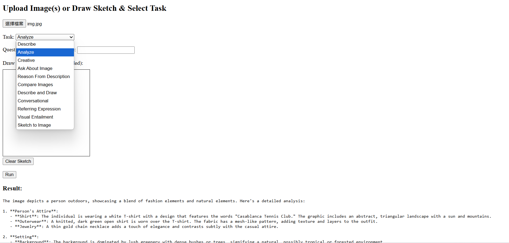

# VisionGPT: Visual Intelligence Toolkit

This is a project that demonstrates a multi-functional visual intelligence tool powered by OpenAI's GPT-4o.  
It allows users to describe, analyze, reason about, and compare images through a simple web interface.



---

## Features

- **Image Description** (default / analytical / creative)
- **Ask About Image** (VQA-like prompt-based answering)
- **Reason From Description** (step-by-step reasoning)
- **Compare Images** (multi-image side-by-side analysis)
- **Describe and Draw** (caption-based image generation via DALL·E)
- **Conversational Agent** (chat-like vision assistant)

---

## Project Structure
```
VisionGPT/
├── app.py # Flask backend app
├── vision_tools.py # Core logic for image processing with GPT
├── templates/
│ └── index.html # Frontend interface
├── static/ # Optional assets (CSS/JS)
├── demo.png # Screenshot for README
```

## Built With

- Python + Flask – Backend server
- OpenAI GPT-4o – Multimodal image & text model
- DALL·E 3 – Image generation
- HTML / JS – Simple frontend interface

---

## Setup & Run

1. Install dependencies (via `pip`)
   ```bash
   pip install flask openai pillow python-dotenv```
   
2. Set your OpenAI API key

3. Run the Flask app
   ```
   python app.py
   ```

4. Open your browser and visit: `http://localhost:5000`
